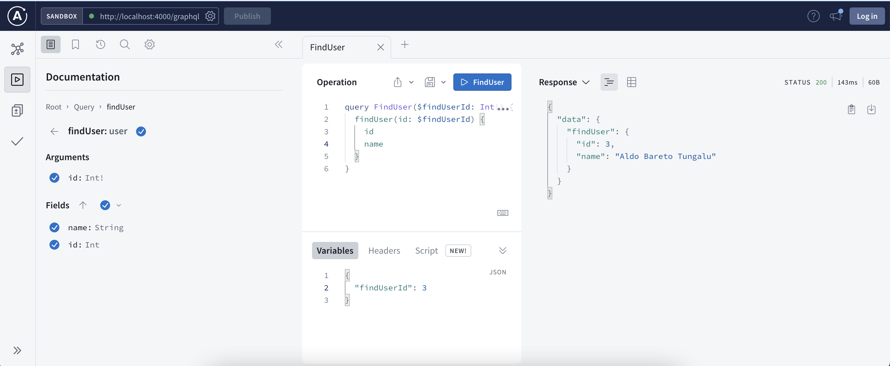

# Simple CRUD Nexus GraphQL with Prisma ORM

# Pre-requisites
- Install [Node.js](https://nodejs.org/en/)

# Getting started
- Clone the repository
```
git clone  <git lab template url> <project_name>
```
- Install dependencies
```
cd <project_name>
npm install
```
- First Installment
```
npm run dev:migrate
npm run dev:seed
```
- Build and run the project
```
npm run dev
```
  Navigate to `http://localhost:4000/graphql`

# Documentation

```
Retrive all data users
```


```
Find detail data user
```


```
Update user data
```


```
Delete user data
```


```
Create user data
```
